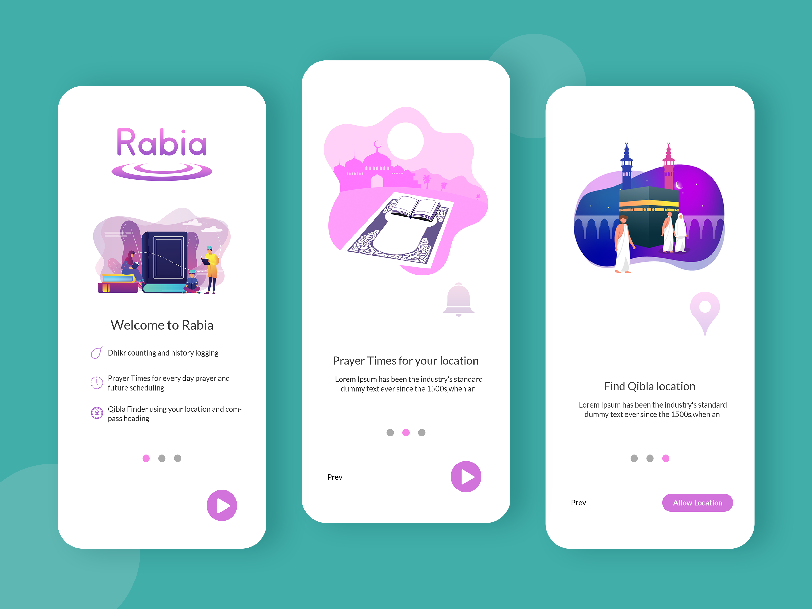

# 🌙 Rabia APP
<p align="center">

</p>
Rabia APP is a modern Islamic mobile application built with **React Native** and **Expo**. The app helps Muslims stay connected with their daily prayers through accurate prayer times, Qibla direction, Dhikr collections, prayer notifications, and a clean, user-friendly experience.

---

# ✨ Features

* 🕌 Daily prayer times
* 🧭 Qibla compass
* 🔔 Prayer notifications
* 🌅 Morning & Evening Dhikr
* 📖 Prayer schedule
* 📍 Automatic location detection
* 🌍 Multiple location support
* 📱 Beautiful onboarding experience
* 💾 Offline data storage
* ⚡ Fast and responsive interface

---

# 📱 Screens

* Splash Screen
* Onboarding
* Home
* Prayer Times
* Prayer Schedule
* Qibla Compass
* Morning Dhikr
* Evening Dhikr
* Settings
* About
* Notifications

---

# 🛠 Tech Stack

### Mobile

* React Native
* Expo
* JavaScript

### State Management

* Redux Toolkit
* Redux Persist

### Navigation

* React Navigation

### Storage

* AsyncStorage
* SQLite

### Expo Modules

* Expo Notifications
* Expo Location
* Expo Sensors
* Expo File System
* Expo Fonts
* Expo Haptics

### Utilities

* Luxon

---

# 📂 Project Structure

```text
assets/
components/
navigation/
redux/
screens/
services/
utils/
hooks/
App.js
```

---

# 🚀 Installation

Clone the repository

```bash
git clone https://github.com/yourusername/Rabia-APP.git
```

Navigate to the project

```bash
cd Rabia-APP
```

Install dependencies

```bash
npm install
```

or

```bash
yarn
```

---

# ▶ Run the project

Start Expo

```bash
npm start
```

Android

```bash
npm run android
```

iOS

```bash
npm run ios
```

Web

```bash
npm run web
```

---

# 📦 Main Features

* Accurate prayer schedule
* Prayer countdown
* Compass-based Qibla finder
* Daily Dhikr
* Notification management
* Location services
* Offline persistence
* Smooth onboarding

---

# 📜 Available Scripts

| Command           | Description    |
| ----------------- | -------------- |
| `npm start`       | Start Expo     |
| `npm run android` | Run on Android |
| `npm run ios`     | Run on iOS     |
| `npm run web`     | Run on Web     |
| `npm test`        | Run tests      |

---

# 📦 Main Dependencies

* React Native
* Expo
* Redux Toolkit
* React Navigation
* Expo Notifications
* Expo Location
* Expo SQLite
* Expo Sensors
* Luxon

---

# 🔮 Future Improvements

* Quran reader
* Audio recitations
* Hijri calendar
* Ramadan tracker
* Mosque finder
* Prayer history
* Widgets
* Multiple languages
* Cloud synchronization

---

# 🤝 Contributing

Contributions are welcome.

Feel free to fork the project, open issues, and submit pull requests.

---

# 📄 License

This project is licensed under the MIT License.

---

# 👨‍💻 Author

Developed by **Kridi Ramilli**.
